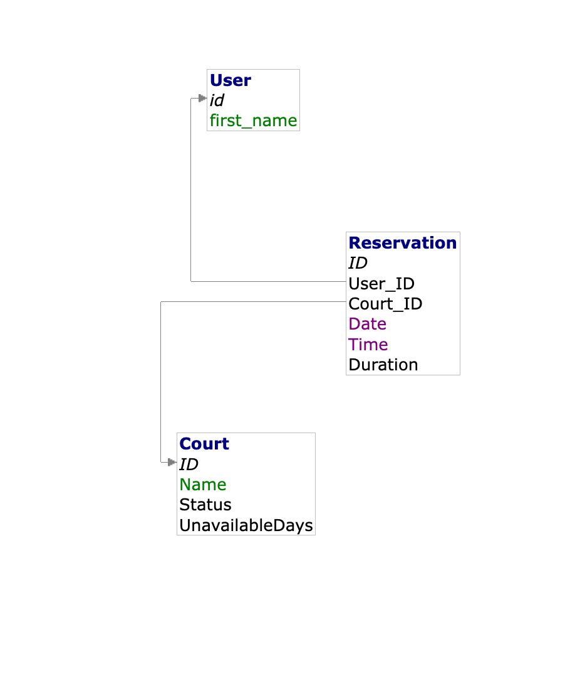

# Service web RESTful de réservation de terrains de badminton

- [Service web RESTful de réservation de terrains de badminton](#service-web-restful-de-réservation-de-terrains-de-badminton)
  - [Lancer le Projet](#lancer-le-projet)
    - [Prérequis](#prérequis)
    - [Lancer le Projet avec Docker Compose](#lancer-le-projet-avec-docker-compose)
    - [Tester](#tester)
      - [API](#api)
      - [Base de données](#base-de-données)
      - [Client graphique Adminer pour la base de données MySQL](#client-graphique-adminer-pour-la-base-de-données-mysql)
  - [Conception](#conception)
    - [Dictionnaire des Données](#dictionnaire-des-données)
    - [Modèle Conceptuel des Données (MCD)](#modèle-conceptuel-des-données-mcd)
  - [Remarques](#remarques)
  - [Références](#références)

## Lancer le Projet

### Prérequis

- Installer [Node.js](https://nodejs.org/en)
- Installer [Docker](https://www.docker.com/get-started/) et [Compose](https://docs.docker.com/compose/)
- Cloner le dépôt et se placer à la racine du projet

> N'oubliez pas de supprimer le dossier `.git` si vous désirez créer votre propre dépôt à partir des sources

~~~bash
rm -R .git
git init 
~~~

### Lancer le Projet avec Docker Compose

1.  Dupliquer le fichier `.env.dist` et le renommer en `.env`

~~~bash
cp .env.dist .env
~~~

2.  Installer les dépendances de l'application node.js et générer la documentation Swagger

~~~bash
pushd api
npm install
npm run swagger-autogen
popd
~~~

3.  Démarrer le projet avec Docker Compose

`docker compose up -d`

### Tester

#### API

- Se rendre à l'URL [localhost:5001](http://localhost:5001/)
- Tester avec [curl](https://curl.se/) : `curl --include localhost:5001`

#### Base de données

- Utiliser le client MySQL depuis la machine hôte

`mysql -uroot -proot -Dmydb -h127.0.0.1 -P5002`

- Exécuter un script SQL en _Batch mode_

`mysql -uroot -p -Dmydb -h127.0.0.1 -P5002 < script.sql`

> Penser à modifier le port si nécessaire dans le fichier `.env`

> _Machine hôte_ : la machine sur laquelle s'exécutent les conteneurs Docker, _votre_ machine

#### Client graphique Adminer pour la base de données MySQL

- Le starterpack inclut [Adminer](https://www.adminer.org/)
- Se rendre sur [http://localhost:5003](http://localhost:5003/) et se connecter avec les credentials _root_ (login _root_ et mot de passe _root_ par défaut), ou avec ceux de l'utilisateur (`user` et `password` par défaut)

## Conception

### Dictionnaire des Données

| Ressource | URL       | Méthodes HTTP | Paramètres d'URL/Variations | Commentaires                                         |
| --------- | --------- | ------------- | --------------------------- | ---------------------------------------------------- |
| Réservation | `/reservations` | `GET`, `POST` | Aucun                       | Liste de toutes les réservations ou ajout d'une nouvelle réservation |
| Détails de Réservation | `/reservations/:id` | `GET`, `PUT`, `DELETE` | `:id` (ID de la réservation) | Obtient, met à jour ou supprime une réservation spécifique |
| Court     | `/courts` | `GET`, `POST` | Aucun                       | Liste de tous les courts ou ajout d'un nouveau court |
| Détails du Court | `/courts/:id` | `GET`, `PUT`, `DELETE` | `:id` (ID du court)         | Obtient, met à jour ou supprime un court spécifique |
| Utilisateur | `/users` | `GET`, `POST` | Aucun                       | Liste de tous les utilisateurs ou ajout d'un nouvel utilisateur |
| Détails de l'Utilisateur | `/users/:id` | `GET`, `PUT`, `DELETE` | `:id` (ID de l'utilisateur) | Obtient, met à jour ou supprime un utilisateur spécifique |

### Modèle Conceptuel des Données (MCD)

<!-- 
Ce n'est pas un MCD, mais un Modèle Logique de Données Relationnel. Sur un MCD, il n'est pas question de modèle relationnel et les clefs étrangères ne doivent pas apparaître. Ces contraintes sont dérivées des associations et de leurs cardinalités à partir du MCD.

Le niveau conceptuel des données (MCD) décrit les entités du monde réel, en termes d'objets, de propriétés et de relations, indépendamment de toute technique d'organisation et d'implémentation des données.

Ce modèle se concrétise par des schémas UML ou entités-associations (Merise) représentant la structure du système d'information, du point de vue des données. Doivent y figurer les données (label, type) regroupées par entité et indentifiées par un identifiant, les associations et leurs cardinalités.

 -->

## Remarques

- Il peut y avoir une erreur au lancement du container du projet dans les logs. Il suffit en général de sauvegarder un fichier.js pour que cela fonctionne.
- Je n'ai pas su comment pouvoir rendre un terrain au choix indisponible de manière temporaire.
  Un terrain indisponible ne peut accueillir de nouvelles réservations.
- Je pense j'aurai dû changer la structure de la base de données.
- Je pense qu'avoir créé des views m'a fait perdre du temps que j'aurai pû utilisé pour mieux structurer mes réponses json hal et mes requêtes.

<!-- 
En effet, c'est dommage. Le but de ce module est de créer une API RESTful, un service web qui doit être consommé par des programmes et non par des humains (HTML). D'autant plus que le dossier views et les vues ne sont pas présentes sur le dépôt pour une raison que j'ignore, ce qui fait qu'aucune représentation de ressource ne peut être servie (erreur 500)
 -->

## Références

- [Express.js Documentation](https://expressjs.com/)
- [MySQL Documentation](https://dev.mysql.com/doc/)
- [RESTful API Design - Best Practices](https://restfulapi.net/)
